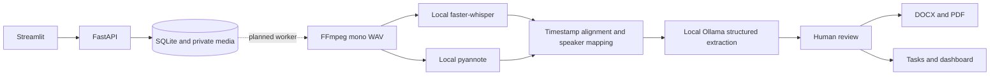

# Architecture and requirement coverage

Reviewed source: “HackAlem AI: Система автопротоколирования совещаний с фиксацией поручений”.
Scoring: function 25, technical implementation 25, README/reproducibility 25,
value 15, development potential 10. No claim of full compliance at scaffold stage.

| Requirement | Scaffold coverage | Next step |
|---|---|---|
| Audio/video input | Working local upload | Probe actual format and bounded decoding |
| RU, KZ, mixed speech | Segment contract and local STT dependency | Adapter and per-language evaluation |
| Diarization and participant assignment | Nullable speaker_id and identity map | Interval alignment and human identity confirmation |
| Tasks, responsible person, deadline | Persistent manual tasks and structured fields | LLM adapter, source evidence, review editor |
| Summary/transcript | Minutes contract | Local structured generation and persistence |
| DOCX/PDF | Exporter contract, dependencies, template directory | Implement and visually verify both formats |
| Dashboard/statuses | Working manual task list and status updates | Editing, approval and per-meeting filters |
| Urgency/direction | Schema fields | Classification and review controls |
| Reminders/distribution | Planned | Durable scheduler and approved internal mail connector |
| Voice identity by timbre | Planned, distinct from diarization | Consent-based enrollment and confidence evaluation |
| Closed-network deployment | Local defaults and deployment guide | Egress-denied integration test |
| Teams/Zoom/Meet or live stream | Deferred; upload is initial input path | Capture adapters subject to privacy constraints |
| Enterprise document management | Deferred optional adapter | Customer-specific integration |

Future worker stages must persist artifacts and errors atomically, support bounded retries,
and run separately from the web request. Do not execute heavy inference in FastAPI's request
loop or rely on in-memory background jobs for recovery. SQLite is suitable for this single-host
base; multi-worker scaling needs a durable queue and database migration plan.

Use FFmpeg subprocess argument lists (never shell-interpolated filenames), timeouts and
resource limits. Decode before trusting media. Match transcript intervals to diarization
intervals; retain ambiguous/overlapping speakers as unknown. A speaker label is not a name.

Treat transcript text as untrusted data in the LLM prompt. Use schema validation and no tool
execution. Preserve evidence quotations and unresolved deadline wording. Never infer a person
or deadline without evidence. Long recordings need chunking with provenance and deduplication;
relative dates need meeting date/timezone. Model output remains a draft until reviewed.

Evaluation milestone: anonymized/synthetic samples in RU, KZ and mixed speech, expected transcript,
speaker turns, tasks and deadlines. Report WER/CER, diarization error, task precision/recall,
owner/deadline accuracy, runtime and memory on named hardware. Check missing owners, missing
deadlines, overlapping speech and malicious transcript instructions. No quality scores yet.
